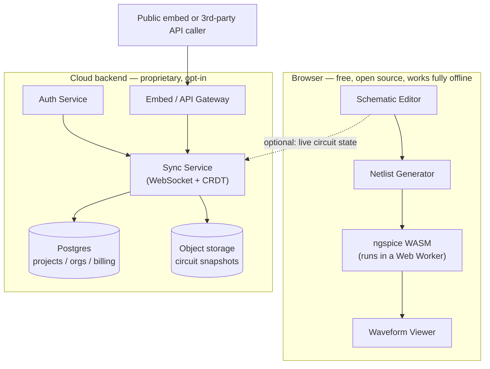

# myEElab — Product Roadmap & Architecture

> **How to use this document:** This file is the source of truth — market thesis, business model, architecture, and the full phased task list. `AGENTS.md` (same folder) is a short, directive companion meant to be loaded at the start of every coding-agent session; it points back here for context. Humans should read this one fully at least once. Agents should read `AGENTS.md` first and dip into this file's phase sections as needed.

---

## 1. Executive Summary

myEElab is a browser-based, SPICE-accurate circuit simulator built in two layers:

1. **A free, open-source, entirely client-side simulation engine** — the trust and adoption layer. It wraps ngspice (compiled to WebAssembly) behind two linked editor views: a **schematic view** (abstract symbols, standard notation) and a **breadboard view** (realistic components, physical wiring, virtual instruments) — the same circuit, two representations, toggle any time. No account, no server, no data leaving the browser.
2. **A proprietary cloud service built on top of it** — the revenue layer. Real-time multiplayer editing, cloud project sync, embeddable circuit widgets, and a simulation-verified AI design assistant.

The core bet, in one sentence: **nobody currently combines full SPICE accuracy with a live, always-simulating feel, a Tinkercad-style physical/breadboard on-ramp, and real-time collaboration.** Every existing tool has at most two of those three. That combination, not any single feature, is the differentiated position. Section 3 justifies this claim against the actual competitive landscape rather than asserting it — including two competitors already moving toward parts of it.

---

## 2. Market Landscape

| Tool | SPICE-accurate | Browser-native | Real-time collab | Embeddable | Always-live sim | Breadboard/physical view | Business model |
|---|---|---|---|---|---|---|---|
| LTspice | Yes | No (desktop only) | No | No | No — edit-then-run | No | Free |
| EasyEDA | Yes (ngspice-based) | Yes | Limited, PCB-layout focused | No | No | No | Free + PCB fab funnel (JLCPCB) |
| Falstad / CircuitJS | No (idealized solver) | Yes | No | Yes, basic | Yes | No | Free, open source |
| EveryCircuit | No (custom real-time engine) | Yes + native apps | No | Yes, paid API | Yes | No (animated flow, not physical) | Subscription + embed licensing |
| iCircuit | No | No (native apps only) | No | No | Yes | No | One-time purchase |
| CircuitLab | Proprietary engine, accuracy unclear | Yes | Unclear | Yes | No | No | Subscription |
| **Tinkercad Circuits** | **No** — simplified models, no DC/AC/transient analysis | Yes | No | Some (public shares) | No | **Yes — its signature feature** | Free (Autodesk); funnels into Fusion 360 for PCB manufacturing |
| **CircuitSim** | **Yes** — real SPICE, DC/AC/transient | Yes | Unclear | Unclear | Unclear | **No — explicitly schematic-only** | Positioned as the post-Tinkercad upgrade; open beta, targeting full launch mid-2026 |
| **Tinkered.ai** | Claims real SPICE physics | Yes | Unclear | Unclear | Unclear | 3D, not classic 2D breadboard | Free; differentiates via AI generation + one-click firmware flashing to real hardware |
| simulator.io / Gate Lab | N/A — digital logic, not analog | Yes | **Yes** | Some | Yes | N/A | Free / freemium |
| Transim (Circuits Cloud) | Varies by integration | Yes, B2B embeds | No | Yes, paid B2B | No | No | B2B licensing to component manufacturers/distributors |

**What this table actually shows:**

- **Collaboration is a solved, normalized pattern** — just not here. simulator.io and Gate Lab already do real-time multiplayer circuit editing well; Gate Lab even has a course-management layer (join codes, assignment submission, instructor review). That's all in the *digital logic* simulator niche, which is a computationally simpler problem than nonlinear analog SPICE.
- **Embeds are already a real, monetized business**, not a novel idea — EveryCircuit charges for its embed API, CircuitLab supports iframe embeds, and Transim has been selling embeddable schematic/simulation widgets to component manufacturers and distributors since at least the 2010s. Good feature, not a moat by itself.
- **The live, always-simulating UX people love (Falstad, EveryCircuit, iCircuit) exists specifically in tools that gave up SPICE accuracy to get it.** Nobody has kept the accuracy and gotten the live feel too.
- **Tinkercad's breadboard view is confirmed not SPICE-based** — it's explicitly a simplified-model tool, not designed for transistor biasing, op-amps, filters, or anything needing real DC/AC/transient analysis. That's precisely why it's beginner-friendly and precisely why serious coursework and projects outgrow it.
- **This gap is actively being raced toward, not empty water.** CircuitSim is a real-SPICE browser simulator explicitly positioned as "what you graduate to after Tinkercad" — but by design it's schematic-only, no breadboard view. Tinkered.ai pairs claimed real SPICE with AI circuit generation and one-click firmware deployment to physical hardware — a hardware-bring-up angle, not a collaboration/embed one. **Neither combines Tinkercad's actual dual-view UX with full SPICE depth and cloud collaboration.** That specific combination is what's still open — see §3.

---

## 3. The Opportunity — Applied Blue Ocean (ERRC)

Using Blue Ocean Strategy's Eliminate–Reduce–Raise–Create grid, applied honestly (including what's *not* open water):

- **Eliminate:** the edit-then-run cycle; the desktop-install requirement.
- **Reduce:** the gap between "toy" simulators and "professional" tools; the friction of sharing a circuit today (export a file, email it, hope your collaborator has the same version of the same tool).
- **Raise:** simulation accuracy inside a UX people already find pleasant (EveryCircuit-grade feel, LTspice-grade correctness); circuit design as a shared, live activity rather than a solo desktop task.
- **Create:** real-time multiplayer editing for SPICE-accurate circuits; a simulation-*verified* AI design loop, where an AI suggestion is automatically checked against a real simulation before it's shown to the user — not just generated and hoped-for; a dual breadboard/schematic view that reuses Tinkercad's proven beginner on-ramp (millions of students already have that muscle memory) but keeps full SPICE accuracy underneath, so the tool a beginner starts on is the same one they never have to graduate away from.

**Be honest about what's already crowded**, so effort doesn't get spent re-fighting a won battle:

- Natural-language-to-schematic generation is a busy, fast-moving 2025–2026 space already — SnapMagic Design, Skimatly, the open-source `easyeda-copilot` MCP tool, and multiple recent research prototypes (CircuitLM, EEschematic) are all working on this right now. Don't lead marketing or roadmap priority with "AI generates your schematic" — that's a race against funded, moving targets.
- What almost none of them do: pair generation with an actual live SPICE engine to **verify and iteratively refine** the result before showing it to the user. Most output an unverified schematic. That closed loop — propose, simulate, check against the stated goal, refine — is the defensible version of "AI circuit design," and it's a natural extension of infrastructure this product already has to build anyway (see Phase B5).
- **"SPICE-accurate successor to Tinkercad" is also actively contested, as of this document's writing.** CircuitSim and Tinkered.ai are both attacking that exact gap in 2026. Neither has shipped a breadboard view alongside real SPICE — that's the one piece of the puzzle still open — but assume this is a race with a shrinking head start, not a quiet corner of the market. Revisit §2's table periodically; this is the fastest-moving row in it.

---

## 4. Business Model — Open Core

**Structure:** MIT/Apache-2.0-licensed core simulator (free forever, runs fully offline) + proprietary cloud layer (subscription revenue). This is not a novel structure — it's a well-proven shape for exactly this kind of tool, built by exactly this kind of team.

**Concrete precedent:** Excalidraw is the closest structural analogue available. Built starting from essentially one engineer, it kept its core whiteboard tool free, open source, and local-first (data lives in the browser, not their servers, by default), then layered "Excalidraw+" at roughly $6–7/user/month for cloud sync, unlimited projects, sharing permissions, read-only links and embeds, comments, and team collaboration management. It grew from roughly 12,000 users in its first weeks to 350,000+ monthly users, on subscription revenue only — no ads, no data monetization. That is the playbook to study, not reinvent.

**Proposed tiers** (illustrative — validate willingness-to-pay for *this specific market* before committing; professional EE hardware buyers behave differently from general knowledge-work SaaS buyers):

| Tier | Price (illustrative) | Unlocks |
|---|---|---|
| Free / Community | $0 | Full local simulator, unlimited local projects, every analysis type, community component library. No account needed. |
| Pro | ~$7–12/mo | Cloud sync + version history, private cloud projects, AI-assist quota |
| Team | ~$15–25/user/mo | Real-time multiplayer editing, shared team component libraries, comments/review, org admin |
| Embed / API | Usage-based or flat licensing | For publishers, educators, component distributors embedding circuit widgets — direct precedent in Transim's and EveryCircuit's existing paid embed businesses |
| Education | Per-institution annual license | Classroom management, assignment distribution, auto-graded submissions — direct precedent in Gate Lab's Lab Hub and CircuitVerse, both in the adjacent digital-logic-simulator market |

---

## 5. System Architecture



**The load-bearing design decision:** simulation itself never touches the cloud layer. Every client — solo or collaborating — runs ngspice locally in its own Web Worker. The Sync Service only ever moves *circuit state* (the graph: components, wires, values), never simulation results and never compute. This is what keeps the free tier genuinely free to operate at scale (no server-side compute cost per simulation) and keeps the privacy pitch ("your circuit never leaves your machine unless you choose to sync it") true even for paying, collaborating users.

---

## 6. Repository Structure & License Boundary

```
/packages
  /core        MIT or Apache-2.0. The free simulator: schematic editor, netlist
               generator, ngspice bridge, waveform viewer. MUST NOT import from
               /cloud or make any network call.
  /cloud       Proprietary, closed source. Sync service, auth, billing, embeds,
               AI assistant backend. MAY depend on /core.
  /web         The app shell that composes /core (+ optionally /cloud). License
               depends on how you choose to distribute the shell itself.
/apps
  /simulator   The deployed product.
  /docs        User-facing documentation.
```

This physical separation is not bureaucratic — it **is** the open-core business model. If proprietary logic leaks into `/core`, the free tier stops being trustworthy as "actually open source," which is the entire adoption mechanism. If `/core` grows a network dependency, the offline/privacy pitch breaks. Treat this boundary as a hard architectural constraint, not a style preference (see `AGENTS.md`).

---

## 7. Data Models

```typescript
// packages/core/src/models/circuit.ts

interface Point { x: number; y: number }

interface Pin {
  id: string;        // stable id, unique within its component type
  label: string;      // e.g. "anode", "gate", "+"
  offset: Point;       // position relative to component origin, pre-rotation
}

interface ComponentInstance {
  id: string;                                 // unique within the circuit
  type: string;                                // "resistor" | "capacitor" | "vsource" | ...
  position: Point;
  rotation: 0 | 90 | 180 | 270;
  mirrored: boolean;
  params: Record<string, number | string>;      // e.g. { resistance: 1000 }
  refDes?: string;                               // "R1", "C3" — assigned at netlist-gen time if absent
}

interface Wire {
  id: string;
  points: Point[];    // polyline; orthogonal segments only
}

interface AnalysisConfig {
  kind: "op" | "tran" | "ac" | "dc";
  params: Record<string, number | string>;
}

interface Circuit {
  id: string;
  name: string;
  components: ComponentInstance[];
  wires: Wire[];
  analyses: AnalysisConfig[];
  // View-specific layout lives separately (below) — a Circuit is the
  // electrical truth; schematic and breadboard are two renderings of it.
}

// Breadboard (physical) view — Phase A7. This is layout data only.
// It never becomes a second netlist path: placements resolve to the
// same Wire[] above via the row/rail adjacency rules, then Phase A2's
// existing node-resolution logic runs completely unchanged.

interface BreadboardHole {
  id: string;   // e.g. "a1".."j30" for the row grid, "pwr-top-red", "pwr-top-blue", etc.
}

interface BreadboardPlacement {
  componentId: string;                 // references a ComponentInstance
  legHoles: Record<string, string>;     // pinId -> BreadboardHole id
}

interface Breadboard {
  id: string;
  layout: "half" | "full";              // hole-grid size
  placements: BreadboardPlacement[];
  jumperWires: Wire[];                  // explicit user-drawn jumpers only —
                                          // row/rail connectivity is implicit,
                                          // derived from shared hole groups,
                                          // never stored as data.
}
```

```sql
-- packages/cloud (proprietary) — starting schema, extend as needed
users (id, email, created_at, ...)
organizations (id, name, plan, created_at)
org_members (org_id, user_id, role)
projects (id, org_id, owner_id, name, visibility, created_at)
project_versions (id, project_id, circuit_json, created_by, created_at)  -- append-only
project_collaborators (project_id, user_id, role)
embeds (id, project_id, public_slug, config_json)
```

---

## 8. Track A — Open-Source Core

Everything in this track ships in `packages/core`. It is entirely normal, AI-assisted-coding-friendly web development, with one exception (ngspice's internals, which you're integrating with, not writing).

### Phase A1 — Prove the ngspice bridge
**Goal:** confirm ngspice-in-WASM works end-to-end before writing a single line of UI.
- [ ] Blank Vite + TypeScript app.
- [ ] Load an existing ngspice WASM build (start from EEcircuit's or ngspice-wasm's build output — don't compile from source yet).
- [ ] Load it inside a Web Worker.
- [ ] Send a hardcoded RC-filter netlist via the shared-library command API.
- [ ] Receive result vectors back via the callback interface; log them.

**Definition of done:** the hardcoded netlist produces numerically sane transient output (voltage decaying on the expected RC time constant), fully in-browser, zero backend calls.
**Non-goals:** no UI, no user-supplied netlists, no error-handling polish yet.

### Phase A2 — Netlist generator
**Goal:** convert an in-memory circuit graph into valid SPICE text.
- [ ] Implement the `Circuit` / `ComponentInstance` / `Wire` types above.
- [ ] Node resolution: merge wire endpoints and component pins into named electrical nodes (union-find or equivalent); ground always resolves to node `0`.
- [ ] Per-component-type netlist line emitters — resistor, capacitor, inductor, independent V/I source to start.
- [ ] Analysis directive emission (`.op`, `.tran` to start).
- [ ] Unit tests: build circuits directly in code (no editor yet), assert generated netlist text, feed to Phase A1's bridge, assert ngspice accepts it.

**Definition of done:** 5+ hand-built test circuits generate correct netlists and simulate successfully end-to-end.
**Non-goals:** no rotation/mirroring logic yet (assume fixed orientation); no semiconductors yet.

### Phase A3 — Minimal schematic editor
**Goal:** a usable canvas editor for the five basic components.
- [ ] Canvas setup with Konva (a raw canvas library, not a node-graph library like React Flow — components have fixed-position pins and need rotation, which graph libraries fight you on); pan/zoom, grid snap.
- [ ] Component palette: resistor, capacitor, inductor, voltage source, ground.
- [ ] Drag-to-place, click-to-wire (orthogonal routing), rotate/mirror with correct pin remapping.
- [ ] Selection, delete, basic undo/redo.
- [ ] Wire editor → Phase A2 → Phase A1 into one live pipeline.
- [ ] Display DC operating-point node voltages directly on the schematic.

**Definition of done:** a user can draw a voltage divider from scratch, run it, and see correct node voltages on canvas.
**Non-goals:** no transient/AC yet; no component search beyond the five basics; no touch/mobile support yet.

### Phase A4 — Transient analysis + waveform viewer
- [ ] `.tran` configuration UI (step size, stop time).
- [ ] Scope-style plot: multiple traces, zoom/pan, cursor measurements (ΔV, ΔT, frequency).
- [ ] Probe tool: click a wire/node to add it as a trace.

**Definition of done:** RC/RL/RLC circuits simulate and plot correctly, cross-checked against hand-calculated time constants.
**Non-goals:** no FFT/spectral view yet — comes with the AC phase.

### Phase A5 — Semiconductors + AC analysis ✅
- [x] Add diode, BJT (NPN/PNP), MOSFET (N/P), and a behavioral op-amp model to the library and netlist emitters.
- [x] `.ac` configuration UI + Bode plot (magnitude + phase, log-frequency axis).
- [x] Basic model-import path: let a user paste a `.model` line or subcircuit from a manufacturer datasheet.

**Definition of done:** a common op-amp filter (e.g. Sallen-Key low-pass) simulates with a Bode plot matching hand calculations within expected tolerance.
**Non-goals:** no proprietary manufacturer model *library* yet — that's a long-tail content problem, not an architecture phase (see Risks, §11).

### Phase A6 — The live-simulation bet
- [ ] Debounced re-simulation on every edit; measure actual latency before optimizing further.
- [ ] Research spike (timeboxed): does ngspice's shared-library mode support warm-starting from a prior operating point, or does every edit force a full re-run from t=0?
- [ ] Define and continuously test a performance budget (e.g., a 20-component circuit re-simulates within 150ms).
- [ ] Graceful degradation: circuits too large/slow for live mode fall back to an explicit "Run" button rather than freezing the UI.

**Definition of done:** a ~20–30 component circuit updates its waveform view within an imperceptible delay as values are edited via sliders.
**Non-goals:** don't chase unbounded circuit size in this phase — define the performance envelope and respect it.

### Phase A7 — Breadboard (physical) view [DONE]
**Goal:** a second, beginner-friendly view of the same circuit — Tinkercad Circuits' signature feature, confirmed above to be the reason it's the default on-ramp for millions of students, paired here with the SPICE accuracy Tinkercad doesn't have. Can start any time after Phase A3; doesn't block A4–A6.
- [x] Encode breadboard connectivity as data, not per-instance logic: holes in the same 5-hole row are implicitly connected; power rails are implicitly connected along their full length (see `Breadboard`/`BreadboardHole` types, §7).
- [x] When a component leg or jumper end lands in a hole, auto-derive an implicit `Wire` to every other occupied hole in the same connected group — this reuses Phase A2's node-resolution unchanged; breadboard mode is a new way of *producing* `Wire` data, never a second netlist path.
- [x] Realistic component art for the parts already in the library: resistor with color bands computed from its resistance value, capacitor body, LED (with correct-polarity enforcement and voltage/current-dependent light-up), pushbutton, potentiometer with a turnable visual, battery pack, colored jumper wires.
- [x] Breadboard canvas: hole-grid snap placement, drag-and-drop from a component tray, bendable jumper-wire tool, row/rail highlight on hover (mirrors Tinkercad's own affordance for showing what's connected).
- [x] View toggle between breadboard and schematic for the same circuit. Placement state is independent per view (rearranging one doesn't scramble the other); both compile to the same `Circuit` electrical graph.

**Definition of done:** a user builds an LED + resistor + battery circuit entirely in breadboard view, toggles to schematic view and sees the equivalent standard schematic, and simulation results match regardless of which view was used to build it.
**Non-goals:** no IC/chip-level breadboard parts yet (op-amps, microcontrollers) — discrete passive/simple-active parts only; one standard board size to start.

### Phase A8 — Virtual instruments
**Goal:** let users practice operating real lab equipment inside the simulator — the direct payoff of the breadboard mode's "hands-on before real life" pitch.
- [ ] Virtual multimeter: draggable onto the canvas, two probe leads the user attaches to specific holes/points, live voltage/current/resistance reading depending on a mode dial that mirrors a real multimeter's.
- [ ] Virtual oscilloscope: probe leads attach to circuit nodes, renders a live waveform for that node (reuses Phase A4's plotting logic, restyled with scope-like volts/div and time/div controls).
- [ ] Both instruments work identically regardless of whether the circuit was built in breadboard or schematic view.

**Definition of done:** a user probes any two points in a running circuit with the virtual multimeter and gets a correct reading, and attaches the virtual scope to see a correct live waveform, using controls that map to how the real instrument is operated.
**Non-goals:** no simulated instrument imperfection (loading effects, noise) for v1 — model as ideal instruments; note as a possible later realism pass.

---

## 9. Track B — Proprietary Cloud Layer

Everything in this track ships in `packages/cloud`. **Do not start this track before Track A phases A1–A4 are done and real, unprompted users are using the free simulator** — see §10.

### Phase B1 — Accounts + cloud project storage
**Goal:** the freemium wedge.
- [ ] Auth (email/password + OAuth) — use an existing provider (e.g. Auth.js, Clerk, Supabase Auth) rather than building this from scratch.
- [ ] `projects` / `project_versions` tables; append-only version history.
- [ ] "Save to cloud" vs. "keep local" choice in the UI — local-first stays the default.
- [ ] Basic project dashboard: list, rename, delete, duplicate.

**Definition of done:** a logged-in user saves a circuit, closes the tab, returns, reloads it, and can recover at least one prior version.
**Non-goals:** no collaboration yet; billing can wait until B4 depending on your GTM read.

### Phase B2 — Real-time collaboration
**Goal:** the flagship paid feature, and the specific gap identified in §2–3.
- [ ] Pick a CRDT library for the circuit graph (Yjs is a reasonable default for JSON-like structures).
- [ ] Sync service: WebSocket server relaying and persisting CRDT updates per project.
- [ ] Presence UI: cursors/selection highlights per collaborator.
- [ ] Explicitly define and test conflict handling (two people editing the same node at once) — don't leave this implicit.
- [ ] Each collaborator's client re-runs ngspice **locally** on sync — only circuit *state* syncs, never simulation results, keeping compute cost off your servers (see §5).

**Definition of done:** two clients editing the same project see each other's changes within ~200ms and converge on identical simulation results.
**Non-goals:** no voice/video for v1 — text presence only.

### Phase B3 — Sharing + embeds
- [ ] Public read-only share links (view + fork).
- [ ] `<iframe>` embed generator, configurable size/theme.
- [ ] Embed view-count analytics (upsell hook for publisher/education tiers).
- [ ] Rate-limiting for public embeds — remember simulation runs client-side in the *embedder's* browser, so this is about asset delivery, not compute protection.

**Definition of done:** a circuit publishes, embeds via iframe on an external test page, and simulates correctly there.
**Non-goals:** no white-labeling yet — that's a later Team/Enterprise upsell.

### Phase B4 — Team & org features
- [ ] Organizations, roles (owner/editor/viewer), shared team component libraries.
- [ ] Comments/review threads anchored to specific components or nodes.
- [ ] Stripe billing, seat-based team plan.
- [ ] Admin dashboard (usage, seats, billing).

**Definition of done:** an org can invite members, assign roles, and be billed per seat monthly.

### Phase B5 — Simulation-verified AI design assistant
**Goal:** differentiated AI — not another text-to-schematic tool (see §3 on why that space is already crowded).
- [ ] LLM-assisted circuit scaffolding from a natural-language prompt, producing a first-draft `Circuit` object.
- [ ] Automatic simulation of the draft against the stated goal (parse the target, e.g. "3.3V output," run `.op`/`.tran`, check the result).
- [ ] Bounded iterative refinement: if simulated behavior misses the target, adjust values and re-simulate before presenting to the user.
- [ ] Always show the user the *verified* simulation result alongside the AI-drafted circuit — never present a suggestion as correct without having actually run it.

**Definition of done:** across a benchmark set of ~20 common requests (voltage dividers, RC filters, simple regulators, LED drivers), the assistant produces circuits that simulate within tolerance of the stated goal, with verification visibly shown.
**Non-goals:** no PCB layout generation — that's a different, already-dominated market (EasyEDA, KiCad).

### Phase B6 — Education tier
- [ ] Classroom/course entity; join codes for students.
- [ ] Assignment distribution (instructor publishes a starter circuit + target spec).
- [ ] Auto-grading: simulate submissions, compare to target tolerance, flag pass/fail.
- [ ] Instructor dashboard for reviewing submissions.

**Definition of done:** an instructor creates an assignment, students submit, and results are auto-graded without manual review.
**Non-goals:** no plagiarism detection, no LMS integration (Canvas/Blackboard) in v1.

---

## 10. Sequencing & Gates

Do not start Track B before Track A phases A1–A4 are complete **and** a handful of real users — not just you — are using the free simulator unprompted. A paid layer only has value once the free layer has adoption; building B2's collaboration engine into an empty room validates nothing.

If you need one Track B phase early as a proof-of-concept (for a co-founder, an investor conversation, or your own motivation), **B1 is the cheapest and lowest-risk** — it's a natural extension of local storage and doesn't require B2's harder sync-engine work.

---

## 11. Risks & Honest Caveats

1. **Live-simulation performance is unproven at scale.** Nobody has shown full nonlinear SPICE re-solving keeping pace with live editing on non-trivial circuits. Phase A6's research spike exists because this is a real technical risk, not a formality — be prepared for the answer to constrain how "live" v1 can actually be.
2. **The model-library long tail.** LTspice's real moat isn't its solver, it's decades of free manufacturer-supplied SPICE models. ngspice's built-in generic device models are solid, but matching LTspice's exact part-level library is a content problem measured in years, not a schedulable phase.
3. **Collaboration's chicken-and-egg problem.** Real-time multiplayer only has value once pairs of people want to co-edit — a weaker pitch for a solo hobbyist than for a team or classroom. Expect B2's early adopters to skew team/education, not individual maker.
4. **Fast-follow risk.** If this gets traction, an incumbent or a fast-moving newcomer can copy collaboration/embed features faster than you can build the model-library moat. Durable defensibility is more likely to come from open-source community trust (the Excalidraw pattern) than from any single feature.
5. **AI feature crowding.** Natural-language circuit generation is already a busy space (§3). Treat B5 as a differentiator through verification rigor, not as a novel category — and re-check this landscape periodically, since it's moving fast.
6. **The Tinkercad-successor gap has a shrinking head start.** CircuitSim (real SPICE, schematic-only, in open beta targeting a mid-2026 full launch) and Tinkered.ai (claimed real SPICE, AI generation, real-hardware firmware flashing) are both moving on this right now. Neither ships breadboard view alongside real SPICE as of this writing, which is why Phase A7 is in the roadmap at all — but that specific gap could close before this product ships if either competitor adds it. Treat A7 as time-sensitive, not evergreen.

---

## 12. Immediate Next Steps

1. Scaffold the repo using the structure in §6, with the license boundary enforced from commit one.
2. Do Phase A1 this week. It's the fastest way to convert the biggest uncertainty into confidence.
3. Everything else — business model refinement, fundraising materials, Track B — waits. The roadmap will look different once the first thing exists.

---

## 13. Sources

- [Excalidraw+ pricing](https://plus.excalidraw.com/pricing)
- [simulator.io](https://simulator.io/)
- [Gate Lab](https://lgsim.io/)
- [CircuitVerse](https://circuitverse.org/)
- [EveryCircuit](https://everycircuit.com/)
- [Transim / Circuits Cloud (EDN)](https://www.edn.com/circuits-cloud/)
- [easyeda-copilot](https://github.com/biosshot/EasyEdaCircuitAI)
- [spicepad](https://github.com/ejkreboot/spicepad)
- [EEcircuit](https://github.com/eelab-dev/EEcircuit)
- [ngspice COPYING](https://github.com/ngspice/ngspice/blob/master/COPYING)
- [Tinkercad Circuits — schematic view](https://www.tinkercad.com/help/circuits/schematic-view-of-circuit)
- [CircuitSim — Tinkercad-alternative positioning](https://circuitsim.com/p/tinkercad-circuits-alternative)
- [Tinkered.ai — Tinkercad-alternative positioning](https://www.tinkered.ai/tinkercad)
